# GMT Advanced Tutorial
For basic tutorial, please visit [here.](https://utpalkumariesas.github.io/GMT_tutorial_for_beginners/)

## Contents:
This tutorial consists of Bash script files to run the GMT. It also contains all the Data files required to run the scripts.

### Bash Scripts:

1. [1spectral_estimation_xy_plots.sh](1spectral_estimation_xy_plots.sh) 

2. [2three-dimensional-mesh-plot.sh](2three-dimensional-mesh-plot.sh): 

  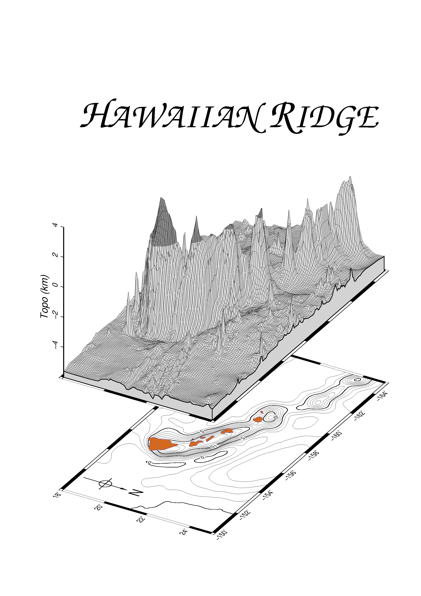
  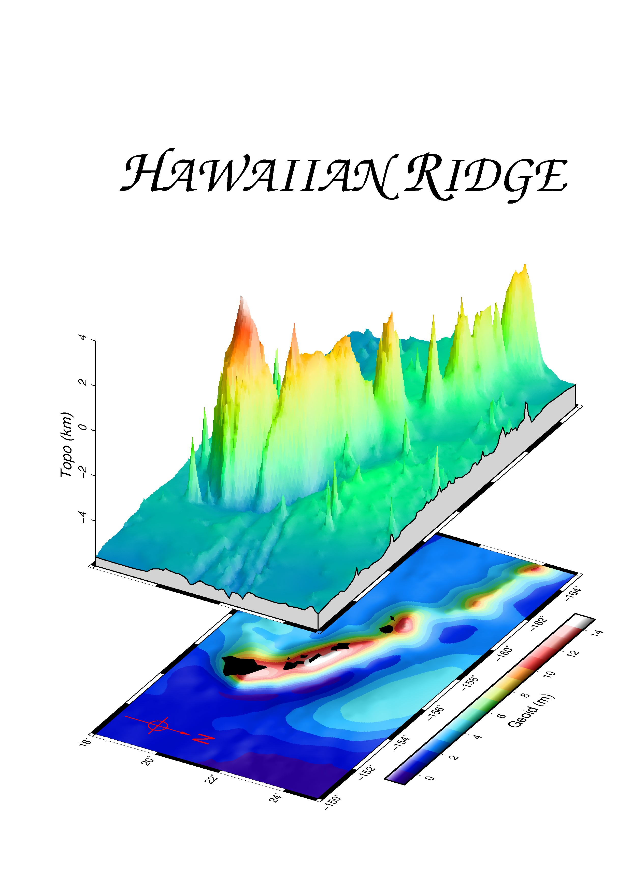
 
 
 
3. [3three-D-surface.sh](3three-D-surface.sh): 

  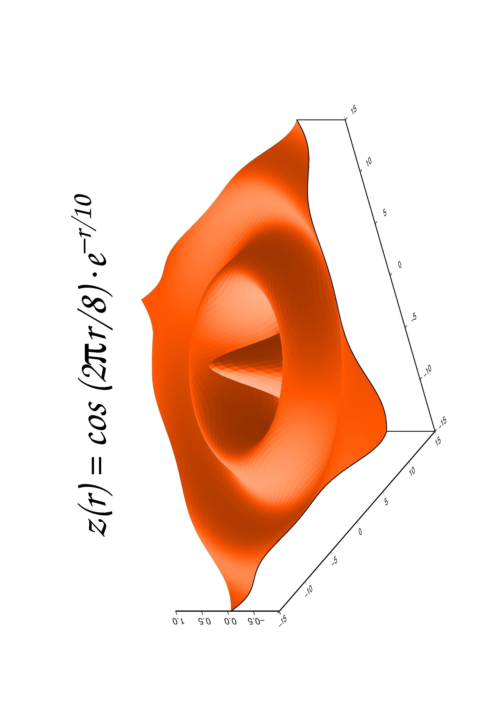
 
 

4. [4plot_histogram.sh](4plot_histogram.sh): 

  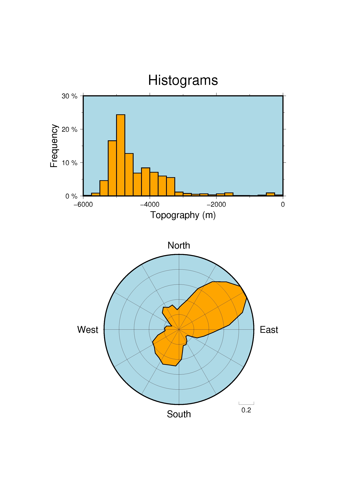
 
 

5. [5simple_location_map.sh](5simple_location_map.sh): 

  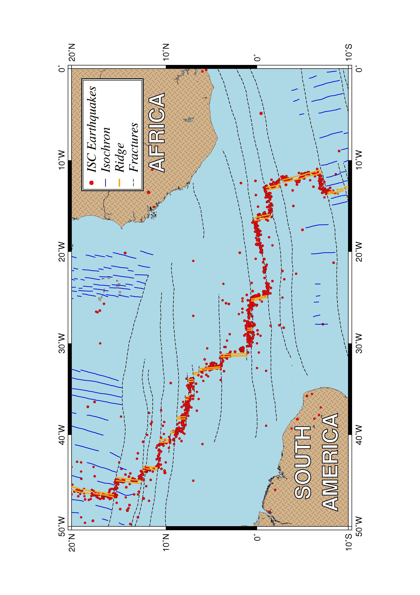
 
 

6. [6time_series_along_tracks.sh](6time_series_along_tracks.sh): 

  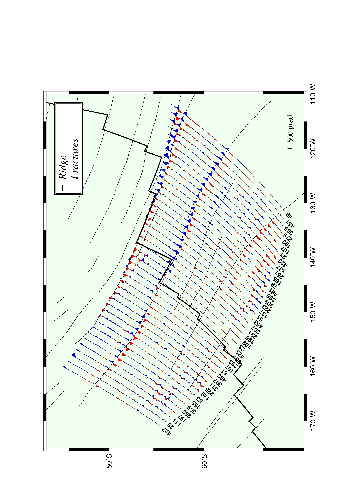
 
 

7. [7geographical_plots.sh](7geographical_plots.sh): 

  
 
 

8. [8gridding_contouring_masking.sh](8gridding_contouring_masking.sh): 

  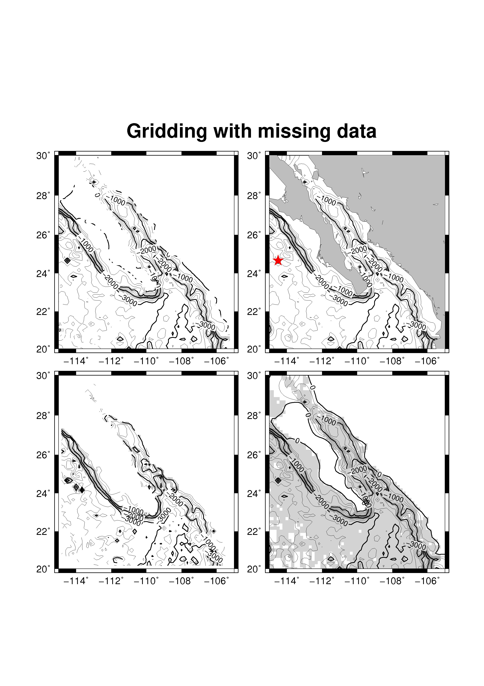
 
 

9. [9clipping_image.sh](9clipping_image.sh): 

  
 
 

10. [10Plotting_custom_symbols.sh](10Plotting_custom_symbols.sh): 

  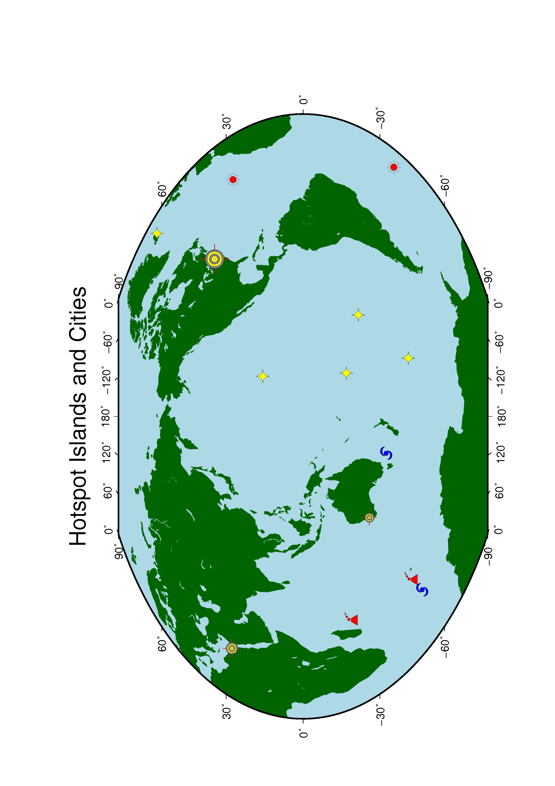
 
 

11. [11seismicity.sh](11seismicity.sh): 

  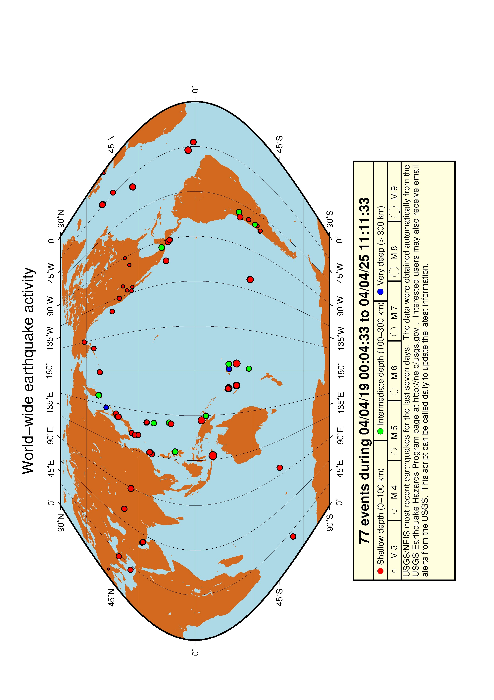
 
 

12. [12great_circle_paths.sh](12great_circle_paths.sh): 

  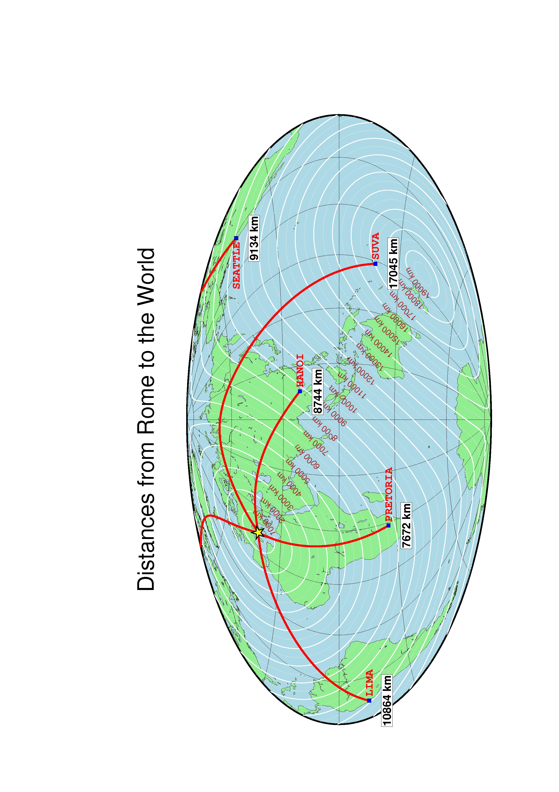
 
 

13. [13Data_selection_geospatial_criteria.sh](13Data_selection_geospatial_criteria.sh): 

  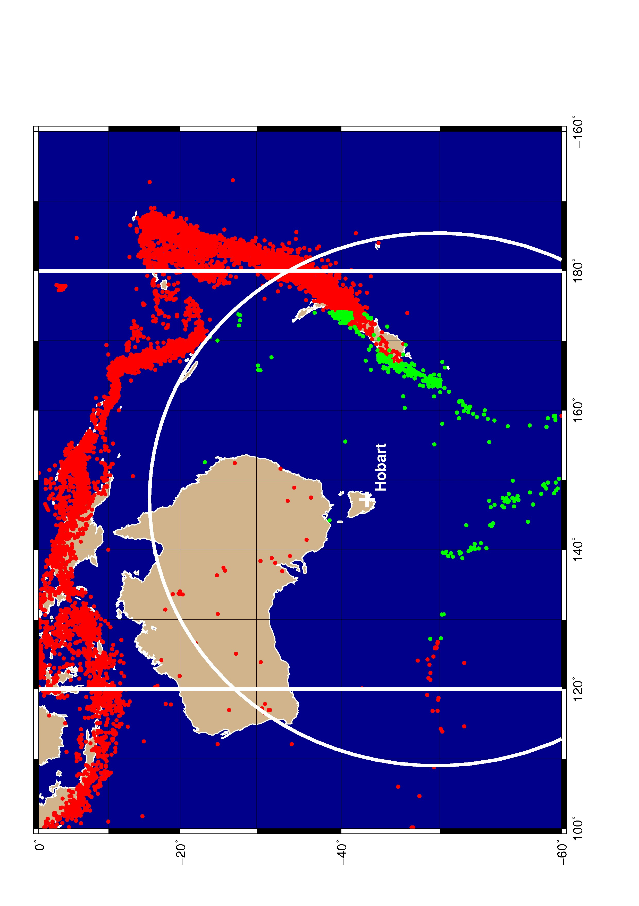
 
 

14. [14map_inserts.sh](14map_inserts.sh): 

  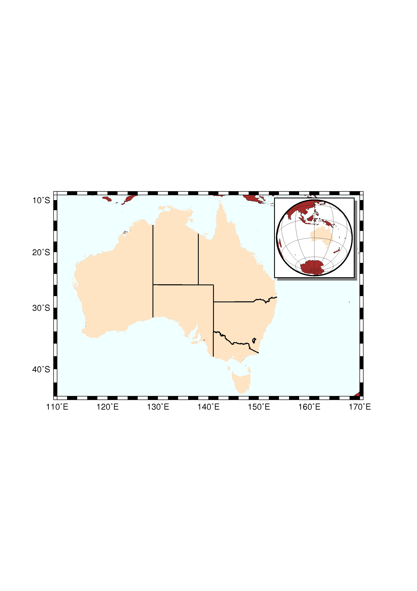
 
 

